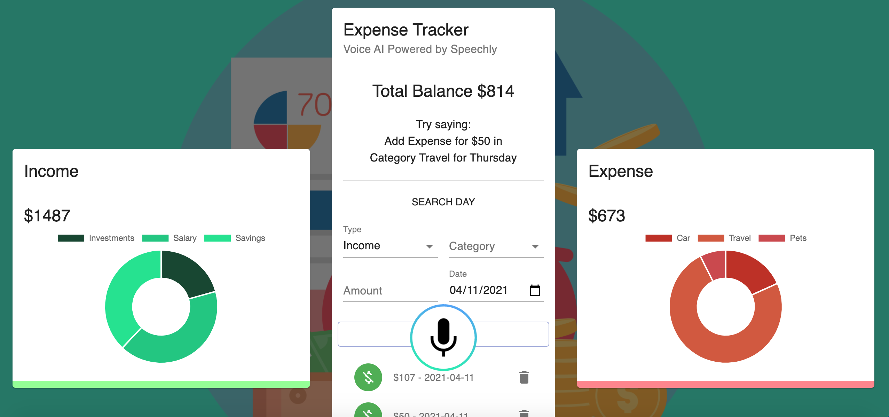

# Speechly Expense Tracker
**Live At**: https://expe-tracker.netlify.app

Features:
- Easy Income and Expense recording
- Analyzed Income and Expense charts with categories

**In current version, Data only records in the LocalStorage**

Try Voice: "Add Expense for $50 in Category Travel for Thursday"\
Try Voice: "Add Income for $50 in Category Salary for Tuesday"\
Demo:

